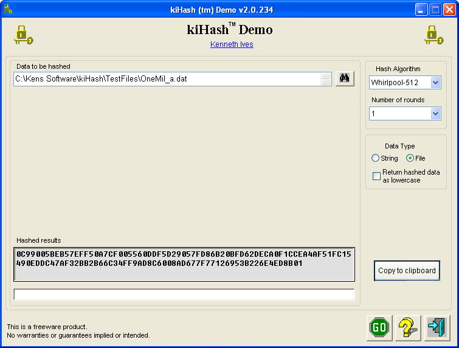



## Multi hash demo  15\-Jun\-2012

### Description

Hash files or text strings using MD4, MD5, SHA1, SHA-2 Family, RipeMD-128 - 320, Tiger3-128 - 512 (my version), or Whirlpool- 224 - 512. Well documented.

=== 25-May-2012 Add SHA-512/320 algorithm to clsSHA2.cls. See LoadConstants_64() routine.

=== 15-Jun-2012 Fixed a calculation bug that I inadvertently introduced while working on another module. Updated cls32BitMath.ByteArrayToLong routine.
 
### More Info
 

             |
---                |---
**Submitted On**   |2012-06-14 18:38:40
**By**             |[Kenaso](https://github.com/Planet-Source-Code/PSCIndex/blob/master/ByAuthor/kenaso.md)
**Level**          |Intermediate
**User Rating**    |5.0 (20 globes from 4 users)
**Compatibility**  |VB 6\.0
**Category**       |[Encryption](https://github.com/Planet-Source-Code/PSCIndex/blob/master/ByCategory/encryption__1-48.md)
**World**          |[Visual Basic](https://github.com/Planet-Source-Code/PSCIndex/blob/master/ByWorld/visual-basic.md)
**Archive File**   |[Multi\_hash2224896142012\.zip](https://github.com/Planet-Source-Code/kenaso-multi-hash-demo-15-jun-2012__1-73499/archive/master.zip)

